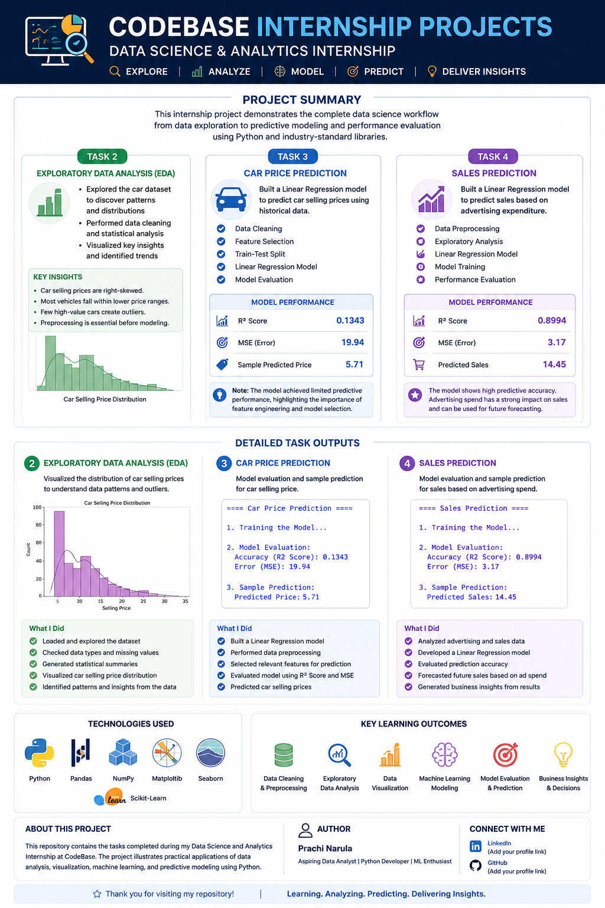
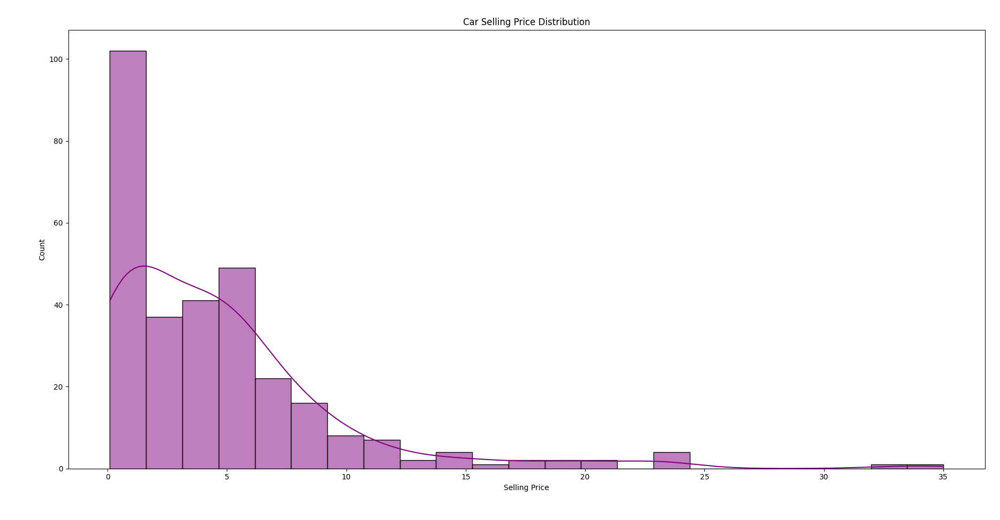
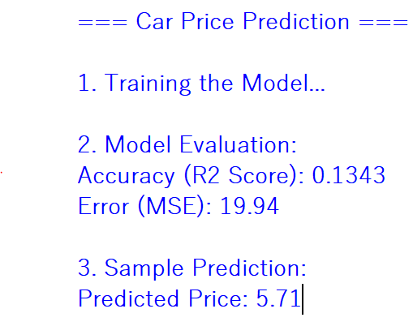
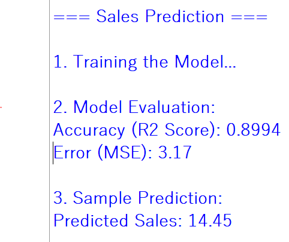

# 🚀 Data Science & Analytics Internship Projects
### CodeBase Studio Internship

Welcome to my **Data Science & Analytics Internship Repository**.

This repository contains projects completed during my internship at **CodeBase Studio**, where I applied data analysis, visualization, and machine learning techniques to solve real-world business problems and derive meaningful insights from data.

The projects demonstrate the complete data science workflow, including:

- Data Collection & Understanding
- Data Cleaning & Preprocessing
- Exploratory Data Analysis (EDA)
- Data Visualization
- Predictive Modeling
- Model Evaluation
- Business Insight Generation

---

# 📌 Internship Project Overview

<p align="center">
  <a href="project_overview.png">
    
  </a>
</p>

This internship provided hands-on experience in working with structured datasets, performing analytical tasks, and developing machine learning models for prediction and decision-making.

---

# 📂 Repository Structure

```text
Data-Science-Analytics-Internship/
│
├── Advertising.csv
├── car_data.csv
│
├── car_eda.py
├── car_prediction.py
├── sales_prediction.py
│
├── project_overview.png
├── EDA_Graph.PNG
├── Car_Price_Prediction.PNG
├── Sales_Prediction.PNG
│
└── README.md
```

---

# 📊 Project 1: Exploratory Data Analysis (EDA)

## Objective

To explore and analyze the car dataset, identify patterns, understand feature distributions, and extract meaningful insights through visualization.

## Visualization

<p align="center">
  
</p>

## Key Findings

- Car selling prices show a positively skewed distribution.
- Most vehicles belong to lower price ranges.
- Premium vehicles create noticeable outliers.
- Data preprocessing is essential before model building.

## Skills Applied

- Data Exploration
- Data Cleaning
- Statistical Analysis
- Data Visualization

---

# 🚗 Project 2: Car Price Prediction

## Objective

To develop a machine learning model capable of predicting car selling prices using historical vehicle data.

## Workflow

- Data Cleaning & Preprocessing
- Feature Selection
- Train-Test Split
- Linear Regression
- Model Evaluation

## Model Performance

| Metric | Value |
|----------|----------|
| R² Score | 0.1343 |
| Mean Squared Error (MSE) | 19.94 |
| Sample Predicted Price | 5.71 |

## Output

<p align="center">
  
</p>

## Project Insights

The model achieved limited predictive performance, highlighting opportunities for future improvements through:

- Advanced Feature Engineering
- Enhanced Data Preprocessing
- Hyperparameter Optimization
- Advanced Regression Algorithms

This project strengthened my understanding of predictive modeling and machine learning evaluation techniques.

## Skills Applied

- Machine Learning
- Linear Regression
- Predictive Analytics
- Model Evaluation

---

# 📈 Project 3: Sales Prediction

## Objective

To predict future sales based on advertising expenditure and evaluate the impact of marketing investments on business performance.

## Workflow

- Data Cleaning
- Feature Analysis
- Model Training
- Sales Forecasting
- Performance Evaluation

## Model Performance

| Metric | Value |
|----------|----------|
| R² Score | 0.8994 |
| Mean Squared Error (MSE) | 3.17 |
| Predicted Sales | 14.45 |

## Output

<p align="center">
  
</p>

## Business Insights

- Advertising expenditure has a strong impact on sales performance.
- The model achieved high predictive accuracy.
- Results can assist organizations in forecasting future sales.
- Data-driven decision-making can improve business outcomes.

## Skills Applied

- Predictive Analytics
- Sales Forecasting
- Machine Learning
- Business Intelligence

---

# 🛠 Technologies & Tools

| Category | Technologies |
|-----------|-------------|
| Programming Language | Python |
| Data Analysis | Pandas, NumPy |
| Data Visualization | Matplotlib, Seaborn |
| Machine Learning | Scikit-Learn |
| Development Environment | Jupyter Notebook |

---

# 🎯 Core Competencies Demonstrated

- Data Cleaning & Preprocessing
- Exploratory Data Analysis (EDA)
- Data Visualization
- Statistical Analysis
- Machine Learning
- Predictive Modeling
- Model Evaluation
- Business Insight Generation

---

# 📚 Key Learning Outcomes

During this internship, I gained practical experience in:

- Working with real-world datasets
- Data preprocessing and cleaning techniques
- Exploratory Data Analysis (EDA)
- Data visualization and storytelling
- Building machine learning models
- Evaluating model performance
- Generating actionable business insights

---

# 👩‍💻 About Me

## Prachi Narula

Aspiring Data Analyst | Python Developer | Machine Learning Enthusiast

This repository showcases the projects completed during my **Data Science & Analytics Internship at CodeBase Studio**, highlighting practical experience in data analysis, visualization, machine learning, and predictive analytics.

## 🔗 Connect With Me

- LinkedIn: www.linkedin.com/in/prachi-narula

---

### Data Science • Analytics • Machine Learning • Business Insights
